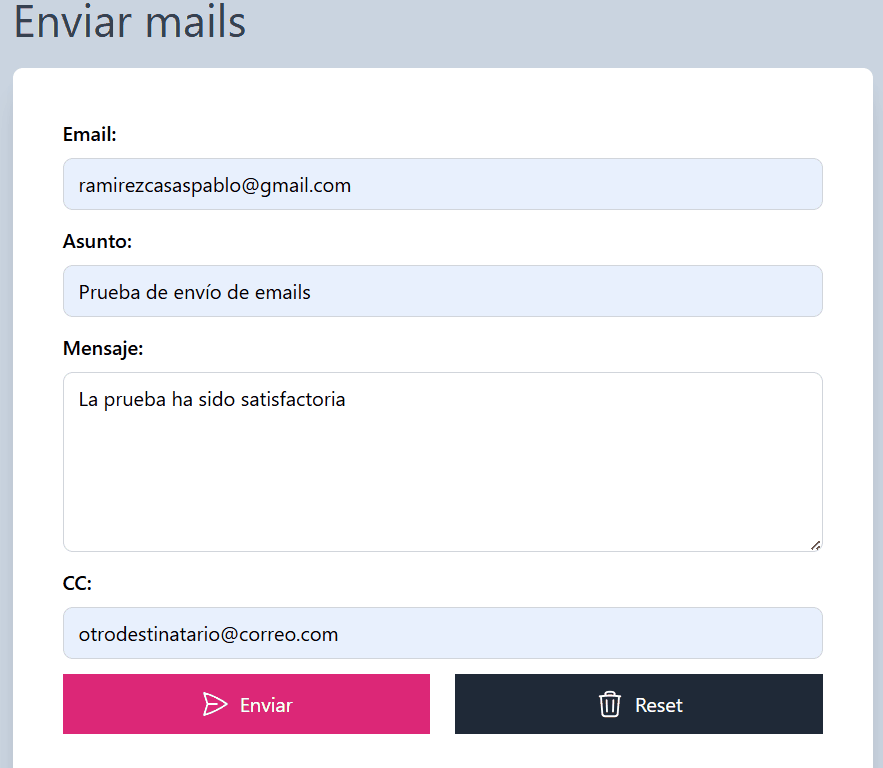
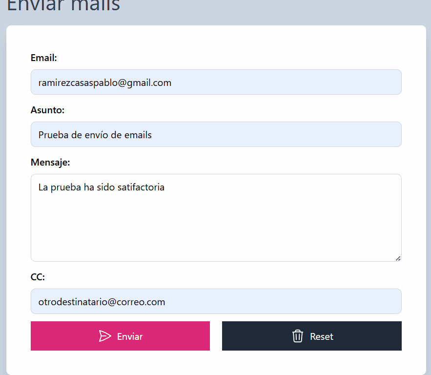

# ✉️ Validador de Envíos - JS Vanilla (Ruta MERN)

## 📽️ Demostración del Funcionamiento

| 📝 Validación Real-Time | 🚀 Simulación de Envío |
| :---: | :---: |
|  |  |

> **Nota:** La aplicación utiliza una **lógica de validación centralizada** para habilitar el botón de envío solo cuando el estado del objeto global es íntegro.

**[🔗 Ver Demo en Vivo]( https://pabloramirezcasas.github.io/validador-email-js/)**


Este proyecto es una interfaz funcional para el envío de correos electrónicos donde se aplican conceptos de validación avanzada y manipulación del DOM, fundamentales para la gestión de formularios en aplicaciones complejas.

## 🚀 Funcionalidades
- **Validación Multicapa:** Comprobación de campos obligatorios y formato de email mediante Regex.
- **Campo CC Dinámico:** Lógica condicional para tratar el campo de copia como opcional pero validar su formato si se interactúa con él.
- **Feedback de Usuario:** Inserción dinámica de alertas de error y mensajes de éxito con temporizadores.
- **UX Optimizada:** Bloqueo de interfaz y uso de Spinners durante la simulación del proceso asíncrono.

## 🛠️ Conceptos Técnicos Aplicados
- **Objeto Global de Estado:** Uso de un objeto literal para trackear los valores del formulario y sincronizar el estado del botón "Enviar".
- **Expresiones Regulares (Regex):** Implementación de patrones complejos para la validación estricta de sintaxis de correo electrónico.
- **Event Listeners:** Manejo de eventos `input` para validación instantánea y `submit` para el control del flujo de envío.
- **Clean Code:** Funciones reutilizables para mostrar y limpiar alertas, evitando la duplicidad de nodos en el DOM.

## 💡 Aprendizajes Clave
El enfoque principal fue la **Sincronización del Estado del UI**. Comprendí cómo condicionar la interactividad de un formulario basándome en la validez de un objeto de datos interno, una técnica que facilita enormemente la transición hacia frameworks como **React** y su manejo de estados.

## 🔧 Instalación y Uso

1. Clona el repositorio:
```bash
git clone https://github.com/PabloRamirezCasas/validador-email-js.git 